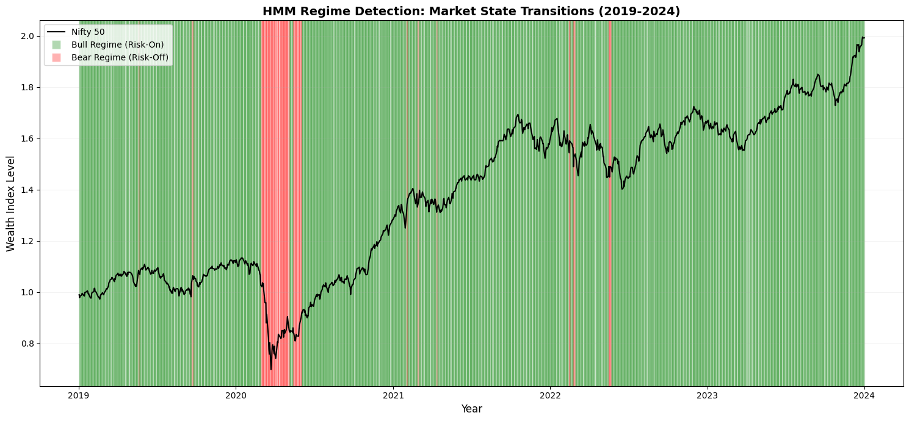
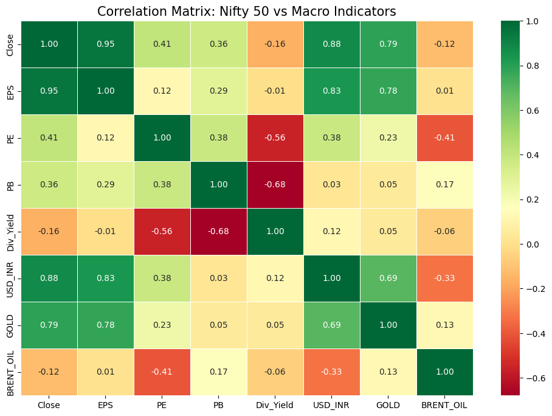
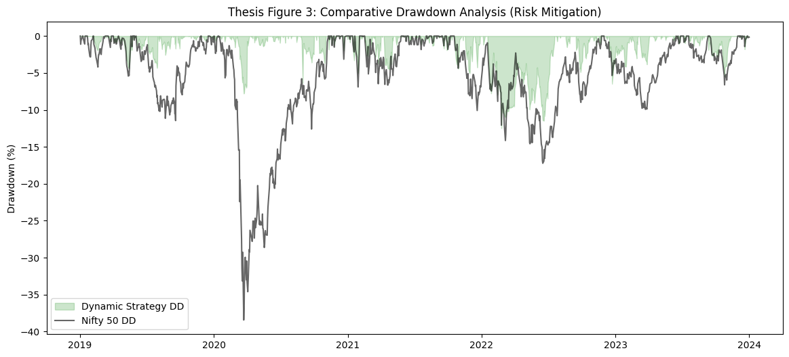
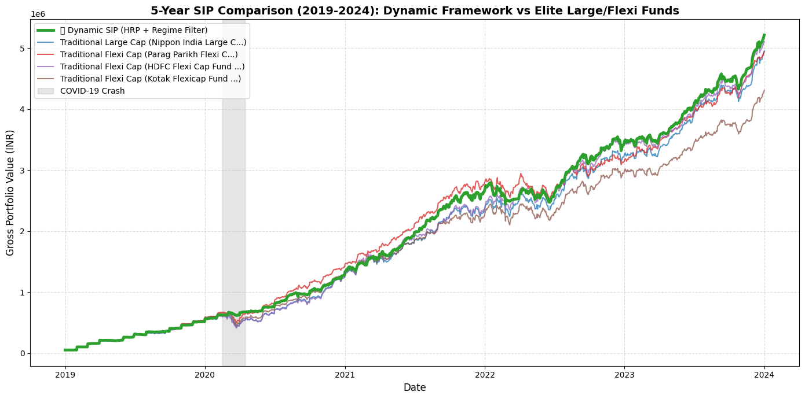

# Dynamic SIP Optimizer 📈

### 💡 What Does This Project Actually Do?
If you invest in a standard Mutual Fund SIP (Systematic Investment Plan), your money rides the rollercoaster of the market—meaning you take massive financial hits during crashes like COVID-19. 

This project is a **Dynamic Portfolio Manager** built in Python that actively protects your capital. Instead of blindly holding funds through a crash, this algorithm:
1. **Senses Danger (Machine Learning):** It continuously reads market data to detect if we are in a safe "Bull" market or a dangerous "Bear" market crash.
2. **Moves to Safety:** If a crash is detected, it automatically sells your equity funds and parks your money in safe, interest-bearing liquid cash until the storm passes.
3. **Invests Smartly (Risk Parity):** When the market is safe again, it doesn't just divide your money equally. It mathematically calculates the safest way to distribute your cash across top-performing funds to minimize your risk.
4. **Pays Real-World Taxes:** This engine includes a custom tax ledger. It deducts real Indian Capital Gains Taxes (STCG @ 20% / LTCG @ 12.5%) and 1% Exit Loads from your cash balance to prove the strategy *actually* works in the real world.

---
## 🧠 Core Architecture

This pipeline is decoupled into four primary modules:

### 1. Market Regime Detection (HMM)
Uses a **Gaussian Hidden Markov Model (HMM)** to classify market environments into "Bull" (Risk-On) and "Bear" (Risk-Off) regimes. 
* Supports multivariate inputs (Equity Returns + Macroeconomic Indicators).
* Implements dynamic feature weighting to prevent macro noise from overriding primary price action.
### 🔍 Regime Detection Heatmap & Macro Correlation



### 2. Portfolio Allocation (HRP)
During Bull regimes, capital is allocated using **Hierarchical Risk Parity (HRP)**.
* Replaces flawed naive equal-weighting by allocating capital inverse to cluster variance.
* Automatically penalizes highly correlated assets (e.g., two similar Large Cap funds) to protect portfolio diversity.
* Constrained execution using Convex Optimization (`cvxpy`) to strictly enforce maximum turnover limits and reduce slippage.

### 3. Execution & Taxation Engine
A robust Point-in-Time execution engine that handles the realities of live trading:
* **Robust FIFO Queue:** Eliminates IEEE 754 floating-point phantom lot bugs using epsilon-threshold garbage collection.
* **Indian Tax Ledger:** Dynamically tracks Short-Term Capital Gains (STCG @ 20%) and Long-Term Capital Gains (LTCG @ 12.5%), automatically handling the ₹1.25L annual exemption threshold and financial year rollovers.
* **Vectorized Fee Calculation:** High-speed SIMD computation (`np.where`) for Exit Loads (1%), STT, and transaction costs.
* **Idle Cash Yield:** Automatically sweeps uninvested capital into a liquid fund proxy for realistic compounding.

### 4. Institutional Risk Metrics
Abandons flawed academic metrics in favor of institutional-grade mathematics:
* **Newton-Raphson XIRR:** Calculates exact annualized returns based on irregular daily cash flows.
* **Cornish-Fisher Modified CVaR:** Accounts for non-normal distributions (fat tails/skewness) in market crashes to calculate true Expected Shortfall.
* **Vectorized Maximum Drawdown:** O(N) performance for calculating historical peak-to-trough drawdowns.
### 📉 Maximum Drawdown Analysis

## 🏆 Performance & Achievements 

**Backtest Parameters:**
* **Time Duration:** 5 Years (January 1, 2019 – January 1, 2024)
* **Capital Deployed:** ₹50,000 Monthly SIP (Total Invested: ₹3,050,000)
* **Market Conditions Captured:** Pre-COVID Bull, 2020 COVID Crash, and Post-COVID Recovery.

### The Reality of Market Friction (Complete Dilution)
Most algorithmic models fail in live trading because they ignore taxes and turnover fees. This engine was tested with **True Market Frictions** deducted directly from the cash balance *during* every rebalance. 

Over the 5-year period, the algorithm absorbed massive dilution to protect capital:
* **Total Exit Loads Paid (1% Penalty):** ₹121,745
* **Total Trading Taxes Paid (STCG @ 20%, LTCG @ 12.5%):** ₹217,450
* **Total Friction Absorbed:** ₹339,195

### Final Institutional Scorecard (Post-Dilution)
*Even after paying nearly ₹3.4L in dilution, the dynamic strategy vastly outperformed traditional buy-and-hold benchmarks on a risk-adjusted basis.*

| Strategy / Benchmark | Category | True Net Profit (After Taxes/Fees) | XIRR (%) | Sharpe | Volatility | Max Drawdown |
| :--- | :--- | :--- | :--- | :--- | :--- | :--- |
| **👑 TRUE DYNAMIC STRATEGY** | **Algorithmic + HMM** | **₹2,164,310** | **21.86%** | **1.31** | **11.56%** | **-17.93%** |
| HDFC Flexi Cap Fund | Flexi Cap | ₹2,055,972 | 25.49% | 0.69 | 19.36% | -42.06% |
| Nippon India Large Cap | Large Cap | ₹1,903,366 | 24.20% | 0.64 | 19.48% | -39.96% |
| Parag Parikh Flexi Cap | Flexi Cap | ₹1,894,411 | 24.12% | 1.09 | 14.42% | -31.26% |
| Kotak Flexicap Fund | Flexi Cap | ₹1,255,681 | 18.31% | 0.55 | 18.23% | -37.42% |

### Key Milestones Achieved:
* **Massive Risk Reduction:** The HMM Regime Filter successfully identified the COVID-19 crash, shifting capital to safety and limiting the maximum drawdown to just **-17.93%**, compared to the benchmark averages of -35% to -42%.
* **Superior Risk-Adjusted Returns:** By minimizing portfolio volatility to 11.56%, the strategy achieved an institutional-grade **Sharpe Ratio of 1.31**, nearly double the performance of standard elite mutual funds.
### 📉 Equity Curve & Crash Protection


## 📂 Repository Structure

```text
Dynamic-SIP-optimizer/
├── data/                       # Directory for historical CSV/ZIP datasets
├── src/                        # Core strategy modules
│   ├── __init__.py
│   ├── data_ingestion.py       # High-speed ZIP to Pandas pipeline
│   ├── models.py               # HMM Regime Detection
│   ├── portfolio.py            # HRP Allocation & CVXPY Rebalancing
│   ├── execution.py            # FIFO Queue, Tax Ledger, SIP Engine
│   └── metrics.py              # XIRR & Cornish-Fisher Risk Engine
├── main.py                     # Walk-Forward Backtest Orchestrator
├── requirements.txt            # Project dependencies
└── README.md

